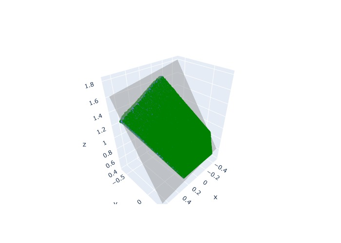

# Plane Segmentation in a Point Cloud Using RANSAC

This is a basic segmentation of plane fitting in point cloud data using (RAN)dom (SA)mple (C)onsensus.

- `ransac.cu` is the CUDA C++ implementation which uses the Open3D C++ API to vusualize.
- `ransac.py` is the Python (NumPy) implementation, using Open3D Python API to visualize.

## Setup

This setup assumes you've installed Anaconda already. If not, please install anaconda from [here](https://www.anaconda.com/products/individual) or from your package manager.

The following packages are required to run this code.

- open3d
- plotly
- matplotlib
- numpy
- python-kaleido

To set up a conda environment and install all dependencies, do the following.

- Create & activate an environment named open3d.

```bash
conda create -n open3d 
conda activate open3d
```

- Install required packages from conda-forge and open3d-admin channel.

```bash
conda install -c open3d-admin -c open3d
conda install -c conda-forge python-kaleido plotly numpy matplotlib
```

## Usage

To test it on custom data, change the source code to represent the path of your data.

Run `python3 ransac.py` to obtain a plot of the data along with the best fit plane.

## Results

The points in green are the points of the data, and the grey part is the best fit plane.

<div align="center">
  
</div>
